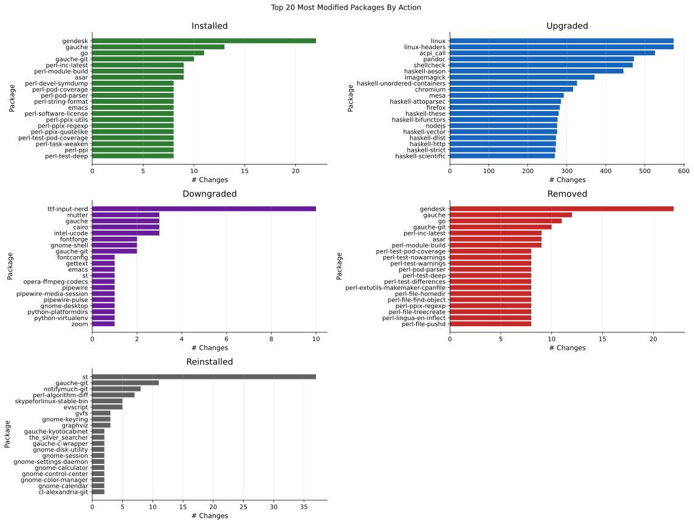

# Visualizations of pacman logs



Did you ever wonder, which packages you installed when, how long they are kept on your system, or which package gets the most frequent updates?  If you are using Arch Linux you can use the information of `/var/log/pacman.log` to generate some nice images to answer these questions.

## Usage

`paclog` is an installable Python package with a command line interface.  Install it in a virtual environment (Arch's system Python is externally managed, so `pip install` into it will refuse):

```bash
python -m venv --system-site-packages .venv
.venv/bin/pip install -e .
```

Then read your log and draw the charts:

```bash
.venv/bin/paclog parse      # /var/log/pacman.log -> data/pacman_history.csv
.venv/bin/paclog plot       # -> SVG charts in visualizations/
.venv/bin/paclog timeline   # -> visualizations/timeline.svg
```

`paclog build` does all three in order.  Without installing, `python -m paclog` works the same way from the repository root.

### Commands

| command           | what it does                                                        |
|-------------------|---------------------------------------------------------------------|
| `paclog parse`    | Read the log into `data/pacman_history.csv` plus a metadata sidecar |
| `paclog stats`    | Print headline numbers (`--json` for machine-readable output)        |
| `paclog plot`     | Render charts; takes chart names, `--list` shows the options        |
| `paclog timeline` | Render the install-period timeline (opt-in; it is the expensive one) |
| `paclog build`    | `parse`, then every default chart, then the timeline                 |
| `paclog list`     | List the available charts                                           |

Useful options, all of which apply to every command:

- `--log PATH`: Read this log instead of the discovered ones.  Repeatable.  Without it, `paclog` reads `/var/log/pacman.log` *and* any rotated or gzipped siblings, so a logrotate setup does not silently cost you most of your history.
- `--tz ZONE`: Timezone for the hour-of-day and month buckets.  `auto` (the default) reuses whatever the parse run resolved; pass an IANA name like `Europe/Berlin` to be exact.
- `--assume-tz ZONE`: Timezone for the pre-2019 log lines that carry no UTC offset.  See [Timezones](#timezones) below.
- `--root DIR`: Base directory for relative paths, so the tool no longer depends on your shell's working directory.
- `--as-of TIMESTAMP`: Treat still-installed packages as installed until this moment.  Defaults to the newest event in the data, which keeps re-runs byte-identical.

## What the data looks like

The CSV has one row per package-affecting ALPM entry:

- `package`: the package name
- `timestamp`: when it happened, as offset-bearing ISO-8601, normalized to UTC
- `action`: one of `installed`, `upgraded`, `downgraded`, `removed`, `reinstalled`
- `version_before`: empty for `installed`
- `version_after`: empty for `removed`

All five actions are recorded.  Note that `downgraded` is easy to miss: it is a real ALPM verb, and the hand-written parser this package grew out of dropped every such event on the author's machine.

Alongside the CSV, `paclog parse` writes `data/pacman_history.meta.json` recording the source logs, the row count, the resolved timezones, and a full account of which lines were skipped and why.  The old parser dropped anything it did not recognise with no trace, so a suspiciously low row count had no explanation available.

## Charts

Run `paclog list` to see the registry.  Two things about them are worth stating outright, because both were got wrong at one point during development and the mistake was invisible in the output:

- The timeline draws *every* package, with *every* one of them labelled.  There is no default cap.  An earlier revision limited it to the 150 packages with the longest history and a later one thinned the y axis labels to roughly 80 of 2 808; both were reverted.  Trimming a chart makes it smaller and useless, and on this log the difference was between a chart you can read and a file you can only measure.  The cost is size: 4.6 MB for 2 808 packages and 3 944 install periods, close to what the original 4.1 MB chart cost while drawing three times as many artists.  If you want a smaller one on purpose, `--top-n` is still there.
- `events_per_month.svg` is one panel per action, each with its own y scale, instead of the original's single stacked bar per month.  A stacked bar cannot encode this log: upgrades are 90.42% of the events and downgrades are 0.07% -- 45 of 68 521 -- so the four minority series collapse into a hairline at the base of every bar and `downgraded` sits flat on zero.  Splitting the panels is the smallest change that makes all five readable at once, and it keeps the monthly bucketing, which is the point of the chart.  Each panel is annotated with its own peak.
- `package_lifetime.svg` used to be 40 bars of exactly the same length, and the problem was the ranking rather than the chart type.  A package that is still installed has been installed for *at least* as long as the log covers, and that lower bound is the same number for every long-lived package, so ranking all install periods by length put whichever packages happened to be installed first at the top: 1 666 of the 3 944 periods are still open, every bar the length of the log, and the three genuinely interesting lifetimes nowhere on the chart.  The two kinds of period are now kept apart.  `installed_whole_time.svg` lists the 331 packages that have been there since the system was built and were never removed, and `package_lifetime.svg` ranks the 2 278 periods that actually ended, where the numbers vary (median 120 days, longest 3 841).  "Since the system was built" means since the last event before the log's first day-long silence, not since the first event: the base install on this machine takes 21 hours and four separate transactions, and testing against the first event finds 73 of the 331 instead of all of them.

## Timezones

Until 2019-10-27, pacman wrote timestamps without an offset; after that it writes ISO-8601 with one.  A single log file can contain both, and on the author's machine roughly a third of the lines are the offset-less kind.

The CSV stores UTC, so rows are unambiguous and sortable.  Charts then bucket in a *display* timezone, chosen by `--tz`; the default reuses the timezone recorded in the metadata.  For the offset-less lines, `--assume-tz` decides what they mean.  Left on `auto`, paclog uses the most common offset found among the lines that do carry one, and records that it did so in the metadata -- but a single fixed offset cannot be right across a DST switch.  Pass an IANA name (`--assume-tz Europe/Berlin`) if you want the naive lines resolved exactly.

## Reproducibility

Charts are committed to this repository, which only works if re-running produces the same bytes.  Three things make that true: the timeline's colours come from a CRC of the package name rather than an unseeded random number, matplotlib's `svg.hashsalt` is pinned, and the creation timestamp is suppressed.  A consequence is that `paclog plot` no longer leaves a dirty working tree, so a modified SVG in `git status` means the data actually changed.

## Notebook

[paclog.ipynb](paclog.ipynb) is an annotated walkthrough of the same questions, written against this author's own history.  Its code cells import `paclog` and call the same functions the CLI does, so the narrative cannot drift away from the tool.

## License

BSD 3-Clause, see [LICENSE](LICENSE).
